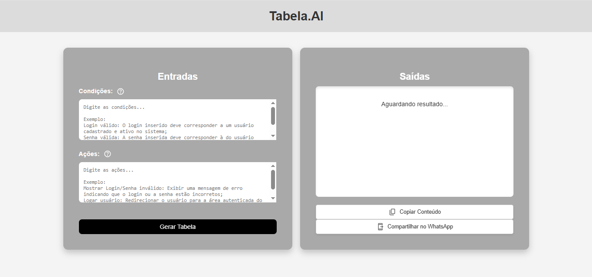

# Frontend Tabela.AI

## Descrição
Tabela.AI é um projeto desenvolvido em React para a criação automática de tabelas de decisão com base em condições e ações definidas pelo usuário. Este repositório contém a implementação do **front-end** da aplicação.



## Pré-requisitos
Para executar o projeto localmente, é necessário ter instalado:
- **Node.js** v22.14.0
- **npm** v10.9.2

## Instalação

Instale as dependências executando o seguinte comando na raiz do projeto:

```sh
npm install
```

Ou utilize a versão curta:

```sh
npm i
```

## Estrutura do Projeto
A estrutura de diretórios do projeto está organizada da seguinte maneira:

```
Tabela.AI/
│-- node_modules/           # Dependências do projeto
│-- public/                 # Arquivos estáticos (favicon, index.html, manifest.json)
│-- src/                    # Código-fonte do projeto
│   │-- App.js              # Componente principal da aplicação
│   │-- App.css             # Estilos da aplicação
│   │-- index.js            # Ponto de entrada do React
│   │-- index.css           # Estilos globais
│   │-- reportWebVitals.js  # Monitoramento de performance
│   
│-- .gitignore              # Arquivos ignorados pelo Git
│-- package.json            # Configurações e dependências do projeto
│-- package-lock.json       # Controle de versão das dependências
```


## Como Executar o Projeto
Para iniciar a aplicação localmente, execute:

```sh
npm start
```

O projeto será iniciado em `http://localhost:3000`.


___

Este projeto foi desenvolvido por [Ueber](https://br.linkedin.com/in/uebersyemmer).
